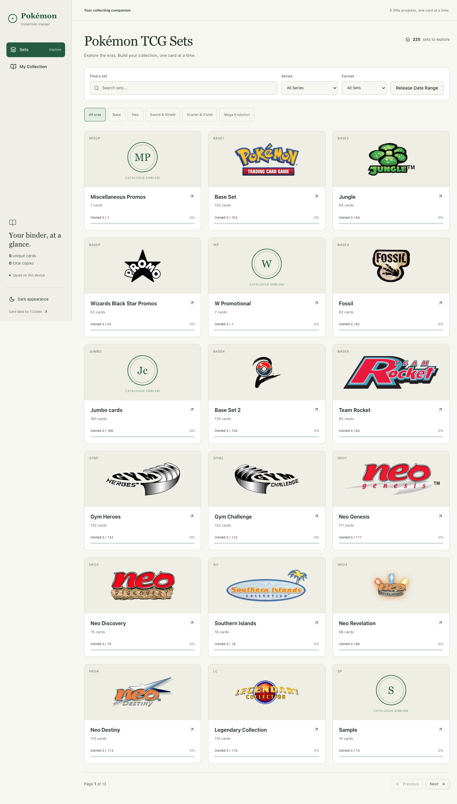

# Pokémon Collection Tracker

## Development coordination

Use the [Pokemon Reseller Agent project](https://github.com/users/ChouBokYann/projects/1) for the shared backlog and current work. Read [CONTRIBUTING.md](CONTRIBUTING.md), [AGENTS.md](AGENTS.md), and [LEDGER.md](LEDGER.md) before starting an issue. Project and repository access are granted separately.


A responsive Pokémon TCG collection tracker for exploring sets, inspecting cards, checking market prices, and recording how many copies you own. The interface uses a collector’s archive style with cream backgrounds, forest-green controls, and artwork-led browsing.



## Features

- Browse sets by series, search by name, and track completion for each set.
- Search within a set and filter cards by ownership before pagination.
- View card artwork, attacks, abilities, artist information, and available market prices.
- Add or remove cards and adjust quantities from the card grid, details, or collection view.
- Keep quantities synchronized across views and save them on the current device.
- Use responsive desktop and mobile layouts, light and dark themes, and visible keyboard focus.

Some filters depend on metadata supplied by the upstream API. Missing images fall back to available set symbols or clearly labelled catalogue emblems.

## Getting started

Use a current Node.js LTS release and npm.

```sh
npm install
cp .env.example .env.local
npm run dev
```

Open the local URL printed by Vite, normally `http://localhost:5173`.

To enable the additional Cardmarket source, set your own key in `.env.local`:

```dotenv
PTCG_API_KEY=your_provider_key_here
```

Get a key from [pokemontcgapi.com](https://pokemontcgapi.com/free-api-key). Restart the development server after changing the key. The key is optional: without it, available TCGdex pricing remains usable.

`.env.local` is ignored by Git. Keep `PTCG_API_KEY` server-side; never give it a `VITE_` prefix, which would expose it to the browser.

## Card information and prices

[TCGdex](https://tcgdex.dev/) supplies sets, series, card details, artwork, and fallback marketplace prices.

When a card is opened, the app requests additional Cardmarket data through its own `/api/cardmarket/:cardId` endpoint. The server authenticates with [pokemontcgapi.com](https://pokemontcgapi.com/cardmarket-price-api), verifies the card identity, and returns only normalized English, ungraded Cardmarket price rows. The UI retains each row’s condition, printing, pricing basis, and observation date. Asking prices describe seller listings and should not be interpreted as completed sales.

Cardmarket EUR prices are displayed as estimated SGD using dated [ECB reference rates via Frankfurter](https://frankfurter.dev/). TCGplayer prices remain in USD. If exchange-rate retrieval fails, the app shows the original EUR prices with an explanation.

Provider coverage and account limits can leave cards without prices. When the additional provider is unavailable or has no usable data, TCGdex prices remain the fallback. The UI identifies the source used.

To conserve API credits, server responses are cached for six hours, concurrent requests for the same card are shared, and uncached requests are limited. Prices are fetched on demand rather than preloading the entire catalogue. See [Cardmarket integration details](docs/cardmarket.md).

## Collection storage

Collection quantities are stored in the browser’s `localStorage`, using the existing version 3 format. There are no accounts or cloud synchronization. Data belongs to the current browser and origin; clearing site storage removes the saved collection. Existing saved collections are migrated by the app when needed.

## Development commands

```sh
npm run dev       # Local app with the server-side pricing endpoint
npm run build     # Type-check and create dist/
npm run preview   # Verify the built app locally, including pricing middleware
npm test -- --run # Run the test suite
npm run lint      # Run the repository ESLint checks
```

If Node’s experimental Web Storage conflicts with the test environment, run:

```sh
NODE_OPTIONS=--no-experimental-webstorage npm test -- --run
```

The repository currently has pre-existing lint findings outside the updated application files; a full lint run may report these.

## Deployment

GitHub Pages deployment is handled by `.github/workflows/deploy-pages.yml` on every push to `main`, or manually from the Actions tab. Set **Settings → Pages → Source** to **GitHub Actions**. The workflow builds with the Pages URL base path and publishes `dist/` to https://perryong.github.io/pokemon-tracker/.

`npm run build` creates the frontend in `dist/`. The authenticated Cardmarket integration also needs a server endpoint: deploying only those static files does **not** deploy `/api/cardmarket/:cardId`.

For production, host an equivalent server or serverless handler based on `server/cardmarket.ts`, configure `PTCG_API_KEY` in its secret environment, and route the frontend’s same-origin pricing requests to it. Apply access controls and shared request limits appropriate to the deployment. Vite preview is for local verification, not a production server.

The application can still browse cards and use available TCGdex prices without this additional endpoint.

## Project structure

- `src/components/` — browsing, collection, card detail, and shared UI.
- `src/lib/` — API adapters, collection persistence, and currency conversion.
- `server/cardmarket.ts` — authenticated pricing middleware and request cache.
- `DESIGN.md` — the implemented visual system.
- `PRODUCT.md` — product context and constraints.
- `.impeccable/review/` — screenshots from the redesign review.

Built with React, TypeScript, Vite, Tailwind CSS, and Radix UI components. Pokémon names and artwork belong to their respective rights holders; this is an unofficial collection tool.
